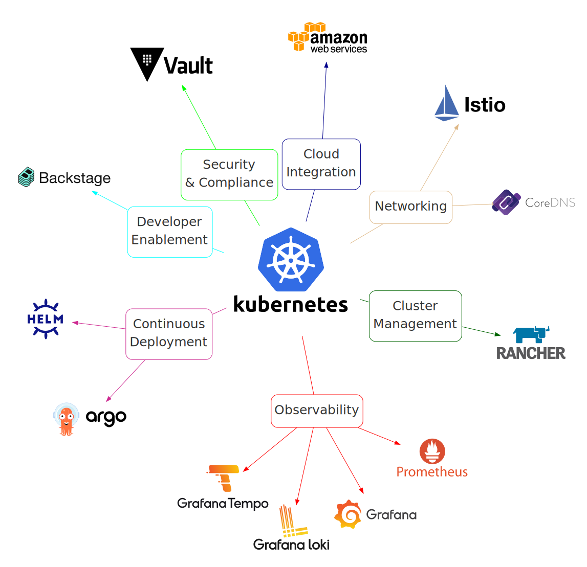

# Logo Diagram Generator 🎨


This package, `logo-diagram-generator`, allows you to generate SVG diagrams that visually represent a technology ecosystem, including tool logos, based on a YAML configuration file. It's designed to help visualize the relationships and categories of tools within a technology stack, making it easier to understand at a glance.

## Example Output

Here's an example of a diagram generated using `logo-diagram-generator`, based on an example configuration:

```bash
docker run -it -v `pwd`:/app beveradb/logo-diagram-generator -c examples/full.example.yml
```



## Quick Start

1. **Install the Package**

   Ensure you have Python and pip installed on your system. Install `logo-diagram-generator` from PyPI:

   ```bash
   pip install logo-diagram-generator
   ```

   **🐳 Alternately, use Docker and skip to step 3! 🎉**
   ```bash
   docker run -it -v `pwd`:/app beveradb/logo-diagram-generator
   ```
   If you use Docker, you don't need to install anything on your system as the tool runs in a container.

2. **Install Graphviz**

   This tool uses [Graphviz](https://graphviz.org/) to render the graph, so you need the graphviz binaries installed on your system for this to work.

   Depending whether you're installing in a conda environment, or directly on your Mac or Linux system, one of these commands should be what you need:

   - conda install graphviz
   - brew install graphviz
   - sudo apt-get install graphviz

3. **Prepare Your Configuration**

   Create a `config.yml` file for your own diagram by copying one of the provided examples. `examples/minimal.example.yml` is a simple one to start with.
   
   Edit your config file to list all the tools in your ecosystem, with category groupings as you see fit. The minimum viable config would be one central tool and one group:

   ```yaml
   ecosystem:
     centralTool:
       name: Kubernetes
     groups:
       - category: Cluster Management
         tools:
           - name: Rancher
   ```

   See `examples/full.example.yml` for more configuration examples - these become more relevant when you need to tweak the styles or layout of the diagram after your first run.

4. **Download Logos and Generate Diagram**

   With your configuration ready, run the `logo-diagram-generator` CLI in the same directory as your `config.yml` file, and it will download logos (with interactive input if it isn't able to find one on the first try) and generate your ecosystem diagram:

   ```bash
   logo-diagram-generator
   ```

   This will download the necessary logos and produce an SVG file named `diagram_logos.svg` in your current directory.

   For further customization options for paths and output names, use `--help` to see all available CLI parameters:

   ```bash
   usage: logo-diagram-generator [-h] [-d] [--log_level LOG_LEVEL] [-n NAME] [-c CONFIG] [-l LOGOS_DIR] [-s SKIP_DOWNLOAD] [-o OUTPUT_DIR]

   Generate SVG diagrams of a tech ecosystem, using logos from each tool organised into groups around a central logo.

   options:
   -h, --help                                       show this help message and exit
   -d, --debug                                      enable debug logging, equivalent to --log_level=debug
   --log_level LOG_LEVEL                            log level, e.g. info, debug, warning (default: info)
   -n NAME, --name NAME                             Base name for the output SVG files.
   -c CONFIG, --config CONFIG                       Path to the configuration file.
   -l LOGOS_DIR, --logos_dir LOGOS_DIR              Directory where logos are stored.
   -s SKIP_DOWNLOAD, --skip_download SKIP_DOWNLOAD  Skip downloading logos before generating.
   -o OUTPUT_DIR, --output_dir OUTPUT_DIR           Directory for the output SVG diagram.
   ```

## Customizing Your Diagram

- **Configuration File**: Modify `config.yml` to add, remove, or categorize tools as needed. Each tool can have a `name`, `label`, and optionally an `alias` or `svgURL` for custom logo URLs.
- **Logo Download**: If the automatic logo download doesn't find a logo for a tool, you can specify the URL interactively or manually place an SVG file in the `logos` directory. The file name should match the tool's name in the configuration file, in lowercase.
- **Diagram Appearance**: The appearance of the generated diagram can be customized by modifying the `config.yml` file. See the example configs and Graphviz documentation for more info.

## Contributing

Contributions to improve `logo-diagram-generator` or add new features are welcome. Please submit a pull request or open an issue to discuss your ideas.
